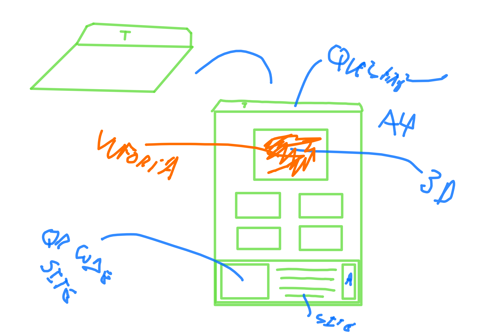
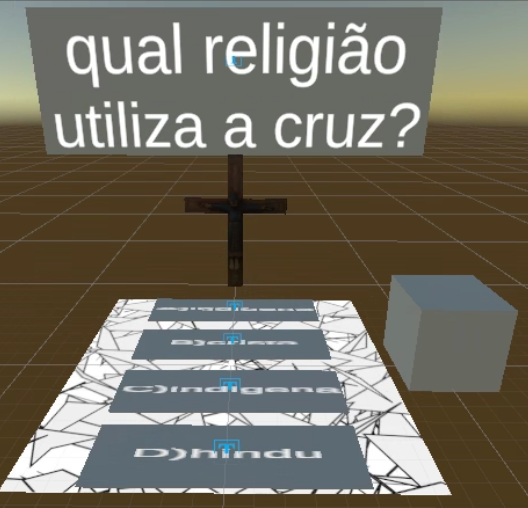

# Anotações das reuniões  

## 2022/08/06  

Conversamos sobre orientação de TCC. Chegamos a um assunto para o Termo de TCC1.

## 2022/08/22

### [Termo](./Termo.pdf "Termo")  

## 2022/08/23

Falou com a professoras Simone Riske Koch (skoch@furb.br) (da religião) junto com o prof. Maurício. Pediu para o Rafael pesquisar alguns materiais. Indicou a [BNCC Catarinenese](CBTC.pdf "BNCC Catarinenese"). Disse que pode testar com os estagiários dela.  
  

## 2022-09-05 - 14:20

[2022-09-05_reuniao](2022-09-05_reuniao.pdf "2022-09-05_reuniao")  

## 2022-09-14 - 15:36

Conversamos quase uma hora sobre dúvidas de como seguir na descrição do Pré-projeto. Em resumo, precisa escrever em si. Precisa pesquisar/ler mais sobre o assunto para escrever. Produziu muito pouco.  Muito atrasado.  

[2022-09-14_PreProjeto](2022-09-14_PreProjeto.pdf "2022-09-14_PreProjeto")  

## 2022-09-27 - 16:39

Revisão do Pré-projeto.  
Tem muitos (muitos) ajustes para serem feitos.  
Arrumar objetivos.  
[2022-09-27_PreProjeto_Dalton](2022-09-27_PreProjeto_Dalton.pdf "2022-09-27_PreProjeto_Dalton")  

## 2022-10-08 - 16:40

Segunda revisão do pré-projeto.  
[2022-10-08_PreProjeto_Dalton.pdf](2022-10-08_PreProjeto_Dalton.pdf "2022-10-08_PreProjeto_Dalton.pdf")  

## 2022-10-12 - 13:04

Pré-projeto: versão entregue para banca.  
Ainda deveria ter mais rodadas de revisão, mas passou o prazo de entrega.  
[2022-10-12_PreProjeto_Dalton](2022-10-12_PreProjeto_Dalton.pdf "2022-10-12_PreProjeto_Dalton")  

## 2022-11-07 - 15:30

Defesa do pré-projeto 
[Video](2022-10-12_PreProjeto_Slides.mp4 "Video")  
[Slides](2022-10-12_PreProjeto_Slides.pdf "Slides")  

## 2023-03-03 - 17:36

Aplicativo de Realidade Aumentada para o Ensino de Religião em Escolas Utilizando Interface de Usuário Tangível.  

Aplicativo que incentive aprendizado da religião por meio de técnicas de realidade aumentada e interface de usuário tangível. Os objetivos específicos são:
a) criar um conteúdo que possa demonstrar os tipos de religiões e descrever lugares, lendas, eventos relevantes e escrituras sagradas;
b) utilizar realidade aumentada e interface de usuário tangível para interagir com o conteúdo;
c) criar um sistema de pontuação através de exercícios relacionados ao conteúdo;

### Simone Riske Koch

Professora indicada pelo Maurício  
<https://comin.org.br/publicacao/semana-dos-povos-indigenas-2016/>  
<https://comin.org.br/publicacao/semana-dos-povos-indigenas-2005-o-povo-xokleng/>  
[Material](SimoneRiskeKoch)  

### Metodologia do Ensino Religioso

Katilene Willms Labes  
G-003  
Material didático  

### Cenário
  
  3 religiões

### Teórica

  Assistir aulas TCC2. Ajustes no projeto.  

### Prática

Unity não mudar de versão.  

- Projeta de telas
ver <https://www.furb.br/dsc/arquivos/tccs/monografias/2019_1_rafael-diegoli_monografia.pdf>

- Vuforia  
- botão virtual  

#### Rotinas

Folha A4

Persistência: local
Site:
  Faixa etária
  folha com os marcadores

Divisão por religião  

### Teste

d) testar o aplicativo com usuários.  
(Simone Riske Koch)  

Dalton: painel 3d para textos

Testar o TCC do Ricardo: <https://github.com/gcgfurb/tcc_RicardoFelipeReiter>

