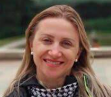

# Anotações das reuniões  

## 2022/08/06  

Conversamos sobre orientação de TCC. Chegamos a um assunto para o Termo de TCC1.

## 2022/08/22

### [Termo](./Termo.pdf "Termo")  

## 2022/08/23

Falou com a professoras Simone Riske Koch (skoch@furb.br) (da religião) junto com o prof. Maurício. Pediu para o Rafael pesquisar alguns materiais. Indicou a [BNCC Catarinenese](CBTC.pdf "BNCC Catarinenese"). Disse que pode testar com os estagiários dela.  
  

## 2022-09-05 - 14:20

[2022-09-05_reuniao](2022-09-05_reuniao.pdf "2022-09-05_reuniao")  
